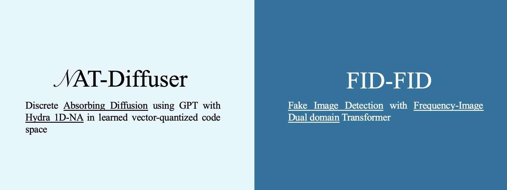
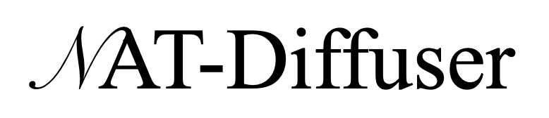
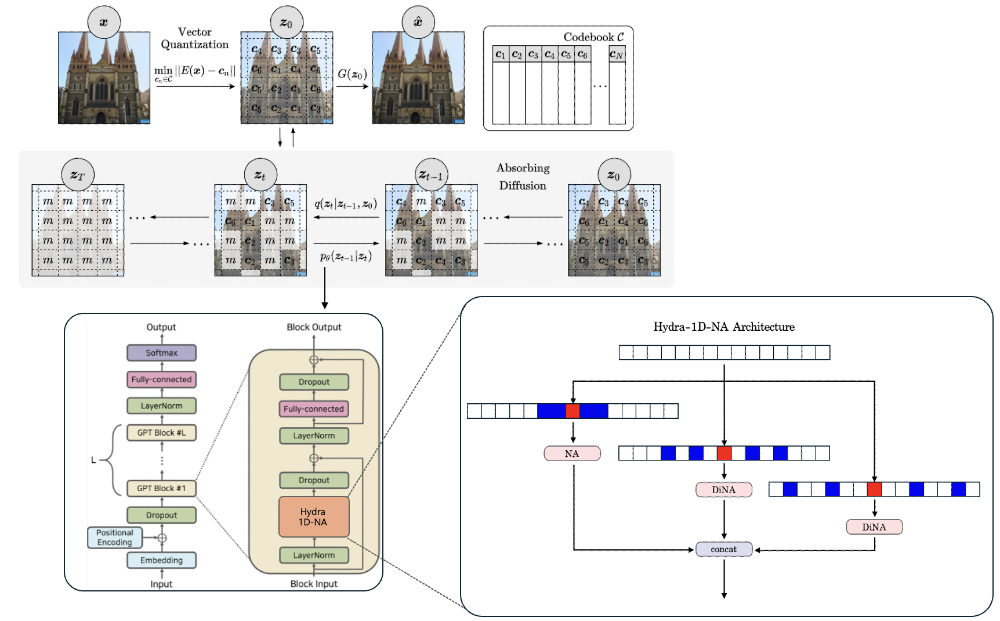
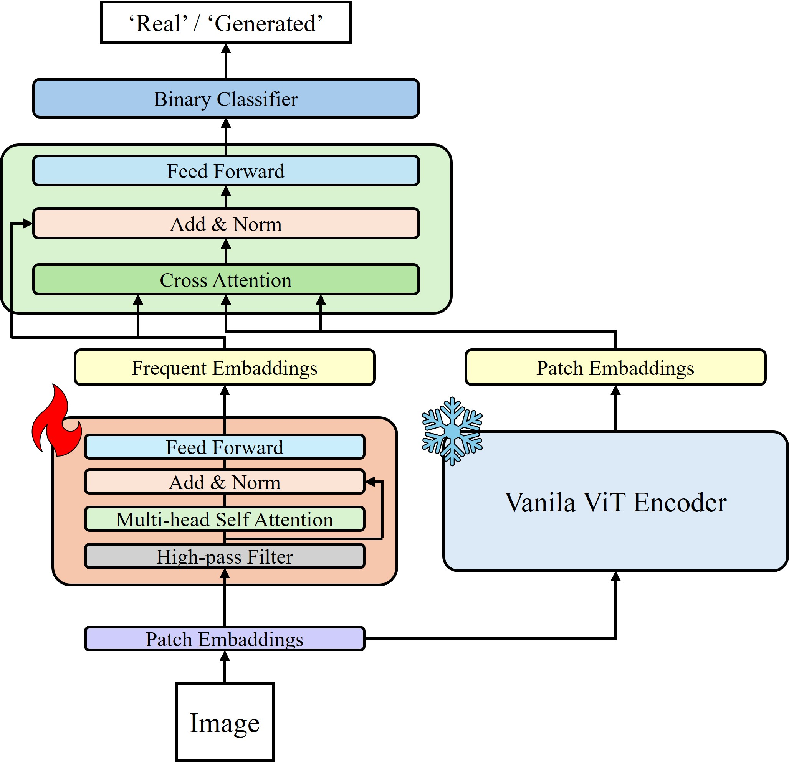

# hyu-deepfakes

<p align="center">
    
</p>

<div align="center">
    2024.04.24 ~ 2024.06.14
</div>


<div align="center">
    <a href="https://drive.google.com/file/d/1ufh3AXevV5hYXNiO0SH9g87KzOkj-m3Z/view?usp=sharing">Paper</a> | 
    <a href="https://drive.google.com/drive/folders/1Rv1AE6oXEGKxbhQbIYhSB1mW32xCjkSO?usp=sharing">PPT</a>
</div>

## NAT-Diffuser

### NAT-Diffuser : Discrete Absorbing Diffusion Meets Neighborhood Attention Transformers at Vector-Quantized Space
<p align="center">
    
</p>


<p align="center">
    <a href="https://github.com/justin4ai/NAT-Diffuser">
        
    </a>
</p>

## FID-FID

### FID-FID : Fake Image Detector Meets Frequency - Image Dual Domain

<p align="center">
    
</p>

## Citation

```
@Junyeong Ahn | Dept. of Data Science, HYU
@Jihong Jeong | Dept. of Data Science, HYU
```
